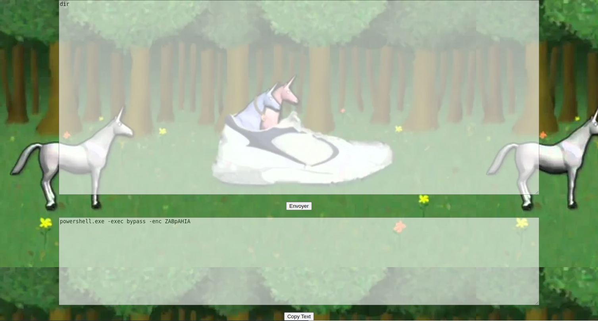

# PowerShell Encoder



# I . What is PowerShell Encoder?
A python web server to encode PowerShell script.
I massively used [Raikia's PowerShell encoder](https://raikia.com/tool-powershell-encoder/]), but now it's down, so I've created my own.
For anybody that doesn't know it's just UTF16-LE Base64 encode.


# II . Run with Docker-Compose

Simply run the following command:
```bash
docker-compose build
docker-compose up
```

Then check your browser at [http://localhost:5000/](http://localhost:5000).


